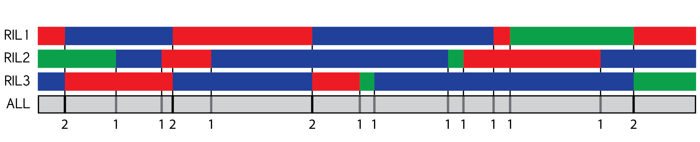
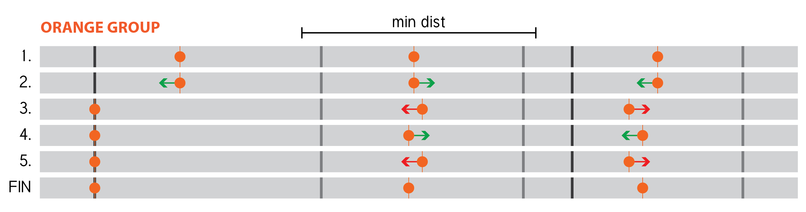

#SNPbinner
SNPbinner is a Python 2.7 package and command line utility for the generation of genotype binmaps based on SNP data across lines.  Analysis using SNPbinner is performed in three parts: `crosspoints`, `bins`, and `visualize`.

##Table of Contents
[**Installation and Usage**](#installation-and-usage)  
[**Commands**](#commands)  
    [crosspoints](#crosspoints)  
    [bins](#bins)  
    [visualize](#visualize)  

#Installation and Usage
_**SNPbinner requires Python 2.7**. Python 3 is currently not supported.   
The only non-standard dependency of SNPbinner is [Pillow](https://github.com/python-pillow/Pillow), a PIL fork._

To install the SNPbinner utility, download or clone the repository and run 

```  
$ pip install REPO-PATH
```  
Once installed, one can execute any of the commands below like so  

```  
$ snpbinner COMMAND [ARGS...]
```  
**Alternatively**, without installing the package, one can execute any of the commands below using 

```
$ python REPO-PATH/snpbinner COMMAND [ARGS...]
``` 


#Commands

##crosspoints
| [Description](#description) | [Usage](#usage) | [Input Format](#input-format) | [Output Format](#output-format) |
|---|---|---|---|

###Description
`crosspoints` uses genotyped SNP data to identify likely crossover points. First, the script uses a pair of hidden Markov models (HMM) to predict genotype regions along the chromosome both with (3-state) and without (2-state) heterozygous regions. Then, the script identifies groupings of regions which are too short (based on a minimum distance between crosspoints set by the user). After that it follows the rules below to find crosspoints. The script then outputs the crosspoints for each RIL and the genotyped regions between them to a CSV file.

---

1. If a group of too-short regions is long enough to be its own acceptably-long genotype region, it will be treated as such and assigned the most likely genotype using the 3-state HMM.

1. If a group of too-short regions is surrounded by regions of the same genotype, all regions within that group are assigned the surrounding genotype.

1. If a too-short region has been genotyped as heterozygous by the 3-state HMM, that section is replaced by the regions identified by the 2-sate HMM. 

2. If the first or last too-short region is neighboring an acceptably-long heterozygous region, the whole grouping will be assigned the heterozygous genotype. 

3. If neither the first or last too-short region is neighboring a heterozygous region, the shortest of those two regions will be assigned to the same genotype as its neighbor. This repeats until the group is empty.


###Usage

Running the `crosspoints` command requires an input path, output path, and a minimum size argument. There are also three optional arguments which can be found in the table below.

```
$ snpbinner crosspoints --input PATH --output PATH (--min-length INT | --min-ratio FLOAT) [optional args]  
``` 

#####Required Arguments
|Argument|Description|
|:-:|:--|
|`-i, --input PATH`| Path to a SNP TSV.|
|`-o, --output PATH`| Path for the output CSV.|
|`-m, --min-length INT`| Minimum distance between crosspoints in basepairs. Cannot be used with `min-ratio`.|
|`-r, --min-ratio FLOAT`| Minimum distance between crosspoints as a ratio. (0.01 would be 1% of the chromosome.) Cannot be used with `min-length`.|

#####Optional Arguments
|Argument|Description|
|:-:|:--|
|`-c, --cross-count FLOAT`| Used to calculate transition probability. The state transition probability is this value divided by the chromosome length. (default: 4)|
|`-l, --chrom-len INT`| The length of the chromosome/scaffold which the SNPs are on. If no length is provided the last SNP is considered to be the last site on the chromosome.|
|`-p, --homogeneity FLOAT`| Used to calculate emission probabilities. For example if 0.9 is used it is predicted that a region b-genotype would contain 90% b-genotype. (Default: 0.9)|

###Input Format
**[Sample input file]()**

|   |Input should be formatted as a tab-separated value (TSV) file with the following columns.|
|---|---|
|0|The SNP marker ID.|
|1|The position of the marker in base pairs from the start of the chromosome.|
|2+|RIL ID (header) and the called genotype of the RIL at each position.|

###Output Format
**[Sample output file]()**

|   |Output is formatted as a comma-separated value (CSV) file with the following columns.|
|---|---|
|0|The RIL ID|
|Odd|Location of a crosspoint. (Empty after the chromosome ends.)|
|Even|Genotype in between the surrounding crosspoints. (Empty after the chromosome ends.)|

##bins
| [Description](#description-1) | [Usage](#usage-1) | [Input Format](#input-format-1) | [Output Format](#output-format-1) |
|---|---|---|---|

###Description
`bins` takes the crosspoints predicted for each RIL and combines similar crosspoint locations to create a combined map of all crossover points across the RILs at a specified resolution. It then projects the genotype regions of the RIL back onto the map and outputs the average genotype of each RIL in each bin on the map. The procedure is as follows. *It should be noted that, to insure the changes are obvious, the illustrations below are showing a map with very low resolution (bin size) and therefore there is significant loss of information. A smaller bin size would create a more accurate map.*

1. The script begins by combining the crosspoints from all lines, including duplicates occurring at the same location.

2. Contiguous series of crosspoints are then grouped together if they are closer to a neighbor than the specified minimum bin size.

4. One-dimensional k-means optimization is then used to find the best placement for the bin boundaries (steps 2 and 4 below). In order to account for the minimum bin-size constraint, once a possible set of boundaries has been converged upon by the k-means algorithm, each mean is adjusted to insure it is at least the minimum distance from it's neighbors (steps 3 and 4 below). If this enters a cycle instead of converging on a working solution, the script will accept the adjusted boundaries without the second optimization step. Otherwise, optimization continues until a solution is reached with appropriately spaced boundaries.  
 <p align="center">_This example finishes due to a cycle (steps 3-5)._

</p>
5. The above step is repeated for every possible number of boundaries that can fit in the span of each group. The boundaries from the best solution of all possible K for each group are then combined into a final list of map-region boundaries.
[]()

`bins` takes a CSV generated using `crosspoints` and a minimum bin size. It identifies a list of bins and their genotypes for each RIL. In order to do so, the crosspoints from all RILs are projected onto one representative chromosome. These crosspoints are then partitioned into groups where the distance between each consecutive crosspoint is less than the minimum bin size. Groups containing less than three crosspoints are combined into one representative crosspoint located at the centroid of the group. If the group contains three or more crosspoints, the maximum number of breakpoints that could fit inside the region bounded by the first and last crosspoint in each list is first determined by dividing the region size by the minimum bin size (rounded up). Then, clustering is performed for all values of K from the maximum number of breakpoints to 1 using a modified 1D K-means algorithm which adjusts the centroid values such that they are greater than a minimum distance from each other during the update step. Each of the produced clusterings are then scored using the average deviation for each cluster to the adjusted centroid. The adjusted centroids from the clustering with the lowest average deviation are then considered to be the representative crosspoints for the group of crosspoints. The representative crosspoints determined for each group are then used as the bounds of the bins created. To genotype the bins for each RIL, the genotype which covers the most area inside of the bin from the original crosspoint data is used. The bin locations, bounds, and genotypes for each RIL are then output in CSV format.
###Usage
Running the bins command requires an input path, output path, and a minimum size argument. Optionally, a binmap ID may also be provided.

```
$ snpbinner bins --input PATH --output PATH --min-bin-size INT [--binmap-id ID]
```

#####Required Arguments
|Argument|Description|
|:-:|:--|
|`-i, --input PATH`| Path to a crosspoints CSV.|
|`-o, --output PATH`| Path for the output CSV.|
|`-l, --min-bin-size INT`| Minimum size of a bin in basepairs. This defines the resolution of the binmap.|

#####Optional Arguments
|Argument|Description|
|:-:|:--|
|`-n, --binmap-id ID`| If a binmap ID is provided, a header row will be added and each column labeled with the given string.|

###Input Format
`bins` uses the output from `crosspoints`.  
For details, see the  **[`crosspoints`Output Format](#output-format)**.


###Output Format
**[Sample output file]()**

|   |Output is formatted as a comma-separated value (CSV) file and has the following rows.|
|---|---|
|0| (Optional) The binmap ID|
|1| The start index of each bin (in base pairs).|
|2| The end index of each bin (in base pairs).|
|3| The location of the center of each bin (in base pairs).|
|4+| RIL ID in the first cell, then the genotype at of the RIL project onto the binmap at for each bin.|
 
##visualize
`visualize` graphs the input and results of the `bins` and `crosspoints`. It can accept three filetypes (SNP input TSV, crosspoint script output CSV, and bin script output CSV). It then parses the files and groups the data by RIL, creating an image for each. In each colored row of the resulting images, regions are colored red, green, or blue, for genotype a, heterozygous, or genotype b, respectively. The binmap is represented in gray with adjacent bins alternating dark and light. The script can accept any combination or number of files for each of the different types.
###To Run:
`$snpbinner visualize -o OUT_FOLDER [OPTIONAL ARGUMENTS]`  

`OUTPUT_FOLDER`: Folder where the resulting images will be saved. The folder must exist.  

Optional Arguments:  
`-s SNP_TSV`: Add SNPs from a SNP TSV to the images. This argument can be repeated for multiple SNP files. 
`-c CROSSPOINT_CSV`: Add genotype regions from a crosspoint CSV to the images. This argument can be repeated for multiple crosspoint files.
`-b BIN_CSV`:  Add binned genotype regions and a binmap from a bin CSV to the images. This argument can be repeated for multiple bin files.


